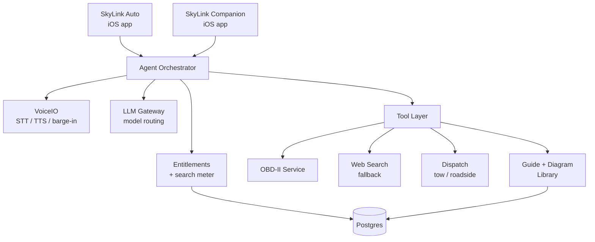

# 2. Platform Architecture

[← Product overview](01-product-overview.md) · [Index](README.md) · Next: [Navigation →](03-navigation.md)

One spine, two heads. Everything below the Agent Orchestrator is shared by both
products.



## iOS app — Swift package layout

```
/SkyLink
 /Shared
  /VoiceIO              # speech in/out, wake word, barge-in
  /AgentEngine          # turn loop, tool calls, streaming
  /PrivacyManager       # permission gates, redaction, local-only flags
  /EntitlementKit       # tier, search meter, paywall triggers
  /DesignSystem         # tokens, components, dark mode, Dynamic Type
  /LoggingService
 /Auto
  /GarageStore          # vehicle profiles, VIN decode, service history
  /GuideRenderer        # step player, diagram canvas, hotspot overlay
  /DiagramKit           # SVG layer renderer, pan/zoom, part highlight
  /OBDService           # CoreBluetooth, ELM327, PID polling, DTC decode
  /RoadsideSOS          # triage flow, location, dispatch, offline cache
  /CategoryDrawer       # the hamburger tree
 /Companion
  /ScreenCaptureService # ReplayKit / Broadcast Upload extension
  /VisionInterpreter    # on-screen element + photo description
  /OverlayGuidanceView
  /ShortcutsBridge
 /App
  /Onboarding
  /Settings
  /Paywall
```

## Backend split

**Node.js (TypeScript)** owns everything user-facing and real-time: auth, accounts,
entitlements and the search meter, subscriptions and webhooks, the agent turn API (SSE
streaming), dispatch partner integrations, and the content API for guides and diagrams.

**Python (FastAPI)** owns the AI and data work: LLM orchestration and prompt assembly,
retrieval over the guide corpus, DTC interpretation models, diagram matching and
generation, and the ingestion pipeline that turns manuals and bulletins into structured
guides.

They talk over an internal gRPC/HTTP boundary. The iOS app only ever talks to Node.

## Database schema (core tables)

Full DDL in [`/schema/schema.sql`](../schema/schema.sql).

| Table | Key columns | Notes |
| --- | --- | --- |
| `users` | id, email, auth_provider, created_at | SkyLink ID |
| `subscriptions` | user_id, tier, status, period_end, store_txn_id | free / garage / industry |
| `usage_meter` | user_id, period_start, ai_searches_used, resets_at | drives the tier caps |
| `vehicles` | id, user_id, vin, year, make, model, engine, mileage, nickname | My Garage |
| `service_records` | id, vehicle_id, job_slug, performed_at, mileage, cost, notes | history |
| `categories` | id, parent_id, slug, title, icon, sort_order | the drawer tree |
| `guides` | id, category_id, slug, title, difficulty, minutes, tools[], parts[], safety_level | one job |
| `guide_steps` | id, guide_id, index, body, diagram_id, warning, checkpoint | ordered steps |
| `diagrams` | id, slug, svg_url, layers jsonb, hotspots jsonb, source, license | labeled art |
| `vehicle_fitment` | guide_id, year_from, year_to, make, model, engine | which cars a guide fits |
| `dtc_codes` | code, system, plain_title, plain_meaning, severity, common_causes[] | P0301 etc. |
| `obd_sessions` | id, vehicle_id, started_at, codes jsonb, live_pids jsonb | scan history |
| `sos_incidents` | id, user_id, vehicle_id, lat, lng, triage_path, outcome, dispatch_ref | roadside |
| `agent_turns` | id, user_id, product, tokens, tools_used[], metered bool | audit + billing |

## Cross-cutting rules

- **Offline first for safety content.** Roadside triage, the emergency checklist, and
  any guide the user has opened in the last 30 days cache on device. Cell service on a
  shoulder is not a given.
- **Metering happens server-side.** The client never decides whether a search counts.
  `agent_turns.metered` is the source of truth.
- **One permission ledger.** Microphone, location, camera, Bluetooth, screen capture —
  all requested just-in-time with a plain-language reason, all revocable in one screen,
  all logged.
