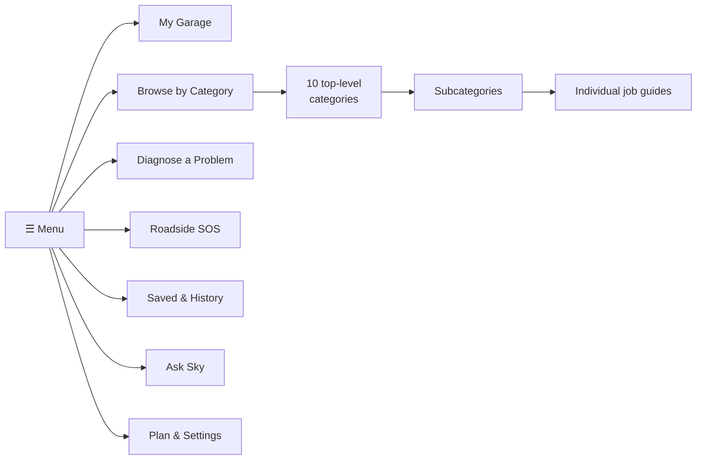

# 3. SkyLink Auto — Navigation

[← Architecture](02-architecture.md) · [Index](README.md) · Next: [Category tree →](04-category-tree.md)

The hamburger drawer slides in from the **left** (thumb-reachable on the side most
people hold with; the right edge stays clear for iOS back-swipe). Tap the icon
top-left, or say "Sky, show me the menu."

## Home screen

Three things above the fold, nothing else:

1. **The ask bar** — a big microphone with "Ask Sky anything about your car." Tap to
   talk, or type.
2. **SOS button** — red, always visible, one tap into roadside triage. Never buried in
   the drawer.
3. **Your car** — the active vehicle card: nickname, mileage, next service due, any
   active check-engine code.

Below that: Continue where you left off, then four or five suggested jobs based on the
vehicle's mileage.

## The drawer

Three levels, never four. Category → subcategory → guide. If something wants a fourth
level it is a step inside a guide, not a menu item.

### Drawer items

| Item | What it opens |
| --- | --- |
| My Garage | Vehicle list, add by VIN scan / plate / manual, service history per car |
| Browse by Category | The full maintenance tree — [section 4](04-category-tree.md) |
| Diagnose a Problem | Symptom-first entry: "it won't start", "it's making a noise", or scan with OBD-II |
| Roadside SOS | Stranded flow — [section 6](06-roadside-sos.md) |
| Find Parts | Cheapest parts nearby and directions — [section 15](15-parts-finder.md) |
| Saved & History | Bookmarked guides, past conversations, past scans |
| Ask Sky | Full-screen chat/voice with the agent |
| Plan & Settings | Tier, searches remaining, permissions, accessibility, units |

## Vehicle context is global

Every guide, every answer, every diagram is filtered by the active vehicle. The
oil-change guide for a 2014 Corolla is not the guide for a 2021 F-150, and showing the
wrong one is worse than showing none. If no vehicle is set, the app asks for
year/make/model/engine before the first guide opens — it is the one piece of setup that
cannot be skipped.

Switching cars is a tap on the vehicle chip in the header, available from every screen.

## Search and entry points

Four ways into the same content, because people describe car problems very differently:

- **Category browse** — for "I know I need to change my oil."
- **Symptom search** — for "there's a grinding when I brake." Natural language, mapped
  to guides.
- **OBD-II scan** — for "the light came on." Code → plain meaning → candidate guides.
- **Photo** — point the camera at the engine bay, a fluid puddle, or a dash light.
  Vision model identifies and routes.

All four converge on the same guide renderer, and all four can be driven entirely by
voice.

## Accessibility baseline (non-negotiable)

- Every screen fully operable by VoiceOver and by voice command alone.
- Dynamic Type to the largest accessibility sizes without truncation.
- Every diagram carries a written long-description and a spoken walkthrough, so a blind
  user gets the same information a sighted user gets from the picture.
- Minimum 44pt touch targets; high-contrast mode; no information conveyed by color alone
  (a red warning also carries an icon and the word "Stop").
