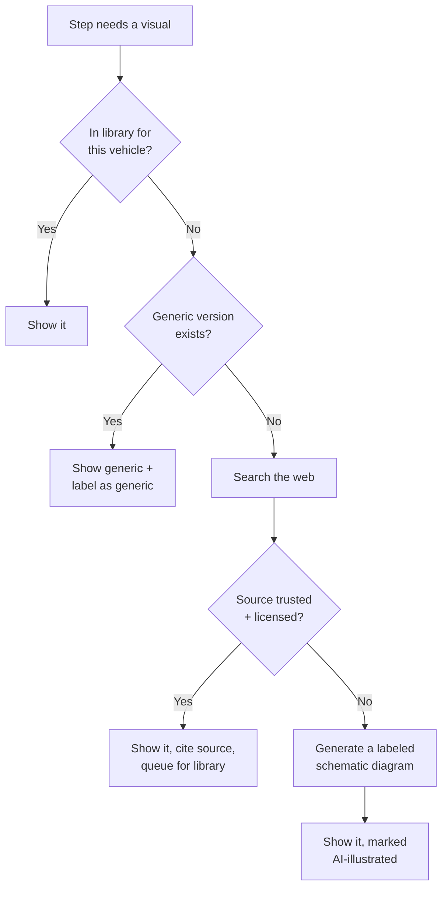

# 5. Guides & Diagrams

[← Category tree](04-category-tree.md) · [Index](README.md) · Next: [Roadside SOS →](06-roadside-sos.md)

## Anatomy of a job guide

Every guide has the same six parts, in the same order, so the user learns the shape
once.

1. **The header card** — job name, your specific vehicle, difficulty, realistic time,
   what it costs to DIY vs. at a shop.
2. **Should you do this yourself?** — one honest paragraph. Sometimes the answer is no.
3. **What you need** — tools and parts as a checkable list, each with a photo and a
   rough price. Tapping a part shows the correct part number for the active vehicle.
4. **Safety gate** — a blocking screen the user must acknowledge before step 1. Not a
   legal footnote: real, specific hazards for this job ("the engine must be cold or you
   will be burned by coolant under pressure").
5. **The steps** — one screen per step. Never a wall.
6. **Finish & verify** — how to confirm it worked, what to do with the old part, and a
   one-tap "log this to my service history."

## Anatomy of a step

One step fills one screen:

- **Diagram at the top, large.** The relevant part highlighted, everything else dimmed.
- **One sentence of instruction.** Under 20 words. "Loosen the drain plug
  counter-clockwise until it turns by hand."
- **A plain-language note** under it if the sentence needs unpacking. This is where
  "counter-clockwise means lefty-loosey" lives.
- **A warning strip** if there is a hazard, in red with an icon and the word, never
  color alone.
- **Checkpoint** — "you should now see..." so the user can confirm they are on track
  before moving on.
- **Stuck?** — one tap hands the step's full context to Sky: "the bolt won't budge."

Voice mode reads each step aloud, waits, and advances on "next" or "done." Saying
"back", "repeat", or "what does that look like" works at any point.

## Diagram standards

Diagrams are the hardest and most valuable asset in the app. They are not stock photos.

- **Layered SVG, not flat images.** Each diagram is a base illustration plus named
  layers: parts, labels, hotspots, highlight overlays. The renderer can spotlight one
  part per step from the same base art.
- **Labeled by default.** Every part a beginner would not recognize carries a leader
  line and a name.
- **Hotspots are tappable.** Tap any labeled part to hear what it does and what goes
  wrong with it.
- **Two themes.** Light and dark versions, both tested for contrast.
- **Orientation cue.** Every engine-bay diagram includes a "you are standing here"
  marker, because a picture with no orientation is useless to someone who has never
  looked at an engine.
- **Written long-description.** Every diagram has a paragraph describing it in words,
  which is both the accessibility text and what the AI reads when reasoning about the
  image.

## The fallback chain — when there is no diagram

When a step or question has no diagram in the library:

Four rules govern that chain:

- **Always say where it came from.** A library diagram, a generic diagram, a web
  source, and an AI-drawn schematic look different and are labeled differently. The
  user always knows which one they are looking at.
- **Licensing is checked before display**, not after. Manufacturer service diagrams are
  not free to redistribute; the app links out to them rather than copying them.
- **Never fabricate a torque spec, a fluid capacity, or a part number.** Those come from
  the fitment database or a cited source, or the agent says it does not have them and
  tells the user where to look (the owner's manual, the door jamb sticker, the cap
  itself).
- **Everything fetched is queued for review.** A web-sourced or AI-generated diagram
  that gets used repeatedly becomes a candidate for a real library asset. The library
  grows from real usage.

## Writing rules for "I know nothing about cars"

Enforced in the content style guide and in the agent's system prompt:

- No unexplained jargon. First use of any term gets a three-word gloss in parentheses.
- No "simply", "just", or "obviously." Nothing about a car is obvious to someone who has
  never done it.
- Direction is always absolute plus relative: "counter-clockwise (lefty-loosey), toward
  the driver's side."
- Every measurement in both units.
- If a step can be done wrong in a way that costs money, say what wrong looks like
  before the user does it.
- Reading level target: 7th grade.
