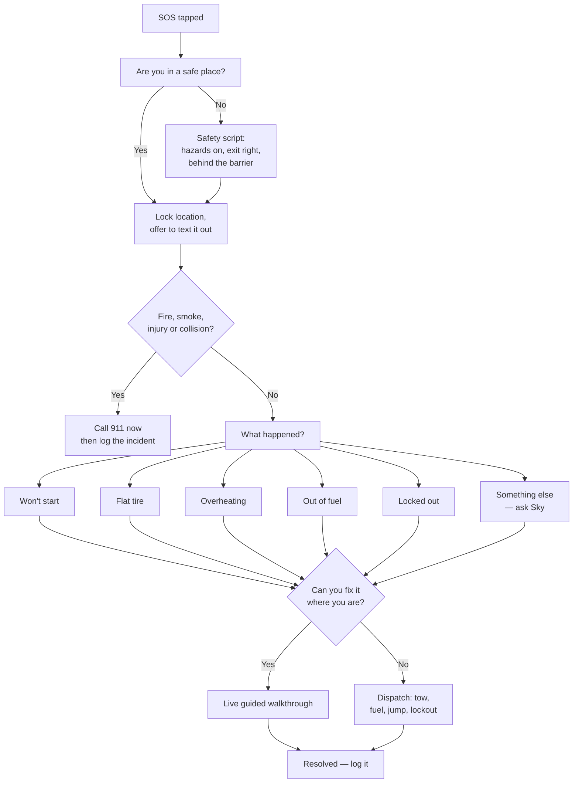

# 6. Roadside SOS

[← Guides & diagrams](05-guides-and-diagrams.md) · [Index](README.md) · Next: [OBD-II →](07-obd-ii.md)

The most important screen in the app. The user is frightened, possibly in the dark,
possibly beside moving traffic, possibly with a dying phone. Every design decision here
is subordinate to that.

## Design constraints

- **One tap from anywhere.** The SOS button is on the home screen and in the drawer, and
  is reachable by saying "Sky, I need help" from any screen.
- **Safety before diagnosis.** The app never asks what is wrong until it has told the
  user how not to get hit by a car.
- **Works offline.** The triage tree, the emergency guides, and the location capture all
  work with no signal. Only dispatch needs the network.
- **Low battery mode.** Below 15%, SOS drops to a black screen, huge text, voice only,
  and offers to send location by SMS before anything else.
- **Never blocked by a paywall.** Roadside SOS is free on every tier, forever. Metering
  a stranded person is indefensible and would be the story that kills the app.

## The flow

## Step 1 — Safety script

Before anything else, spoken and on screen in large type:

> Hazard lights on. If you can still move the car, get it fully off the road, as far
> right as possible. Then get out on the passenger side and stand behind the guardrail
> or well off the shoulder — not next to the car, and never between your car and
> traffic.

The app then asks one question: **"Are you somewhere safe now?"** Everything else waits
for that answer.

## Step 2 — Location, locked

Captures GPS, reverse-geocodes to a street address plus nearest mile marker or cross
street, and offers three one-tap actions: text my location to a contact, copy it, read
it aloud (for when the user is on the phone with someone). Location is captured even
offline and sent when signal returns.

## Step 3 — Emergency screen

One question: is there fire, smoke, injury, or has there been a collision? Yes routes
straight to a 911 call button with the address on screen to read out. The app does not
attempt to diagnose anything in that state.

## Step 4 — Triage

Six big buttons, each with an icon, each also a spoken option. "Something else" opens
Sky with the SOS context already attached — location, vehicle, battery level, and the
fact that the user is stranded, so the agent's first reply is already tuned to that.

## Step 5 — Fix it or get help

The agent makes an honest call and says it out loud. A flat tire on a flat shoulder in
daylight with a spare: walk them through it. The same flat on a narrow shoulder of a
freeway at night: do not, call a tow. That judgment uses location type, time of day,
weather, whether the user reported a safe position, and any accessibility needs on the
profile.

Guided walkthroughs in SOS mode differ from ordinary guides: larger type, voice-led, one
step at a time with no scrolling ahead, and a "traffic check" reminder every few steps.

## Step 6 — Dispatch

| Service | What it covers |
| --- | --- |
| Tow | Destination picker: home, a shop, nearest dealer |
| Jump start | Battery-only calls, cheapest option |
| Fuel delivery | Out of gas |
| Lockout | Keys in the car |
| Tire change | Spare present but user cannot or should not do it |

Integration is through a roadside-assistance API partner. The app also asks once, during
onboarding, whether the user already has AAA or coverage through their insurance or car
manufacturer — and if so, shows that number first rather than selling them a second
service.

## Step 7 — Resolution

Logged to `sos_incidents`: what happened, what fixed it, how long it took, what it cost.
Two payoffs. The user gets a record for insurance or reimbursement, and the app learns —
a car that has needed three jump starts in two months gets told, plainly, that its
battery is dying.
