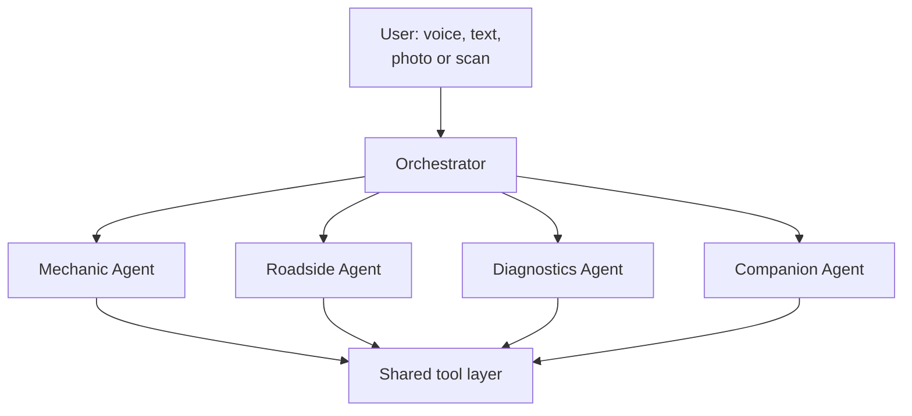

# 8. The AI Agents

[← OBD-II](07-obd-ii.md) · [Index](README.md) · Next: [Companion →](09-companion.md)

Five agents. One orchestrator routes; four specialists do the work.

The full system prompts live in [`/agents`](../agents/) as individual files, ready to
load. This page is the overview and the tool contract.

## Shared tool layer

| Tool | Purpose |
| --- | --- |
| `get_vehicle` | Active vehicle: year, make, model, engine, mileage, history |
| `search_guides` | Retrieval over the guide corpus, filtered by fitment |
| `get_guide` / `get_step` | Pull a guide or a single step |
| `find_diagram` | Library lookup, then the fallback chain in [section 5](05-guides-and-diagrams.md) |
| `web_search` | Licensed, cited external lookup |
| `read_obd` / `decode_dtc` | Live scan and code translation |
| `get_location` | Coarse or precise, permission-gated |
| `dispatch_service` | Tow, jump, fuel, lockout — always user-confirmed |
| `log_service_record` | Write to history |
| `escalate_to_human` | Hand off to a partner shop or advisor (Industry) |

## The agents

| Agent | File | Role |
| --- | --- | --- |
| Orchestrator | [`agents/orchestrator.md`](../agents/orchestrator.md) | Routes to a specialist; answers nothing itself |
| Mechanic (Sky) | [`agents/mechanic.md`](../agents/mechanic.md) | Maintenance, repair, how-to, guide walkthroughs |
| Roadside | [`agents/roadside.md`](../agents/roadside.md) | Stranded users. Safety first, then triage, then dispatch |
| Diagnostics | [`agents/diagnostics.md`](../agents/diagnostics.md) | Codes, freeze-frame, live data, urgency |
| Companion (Halo) | [`agents/companion.md`](../agents/companion.md) | Screen reading, photo description, voice navigation |

Every agent inherits the [safety kernel](../agents/safety-kernel.md), which is
non-overridable.

## Routing rules

- Route to **Roadside** whenever the user is or may be stranded, in traffic, or
  describes anything alarming: smoke, fire, a collision, a loss of steering or brakes.
  When in doubt between Roadside and anything else, choose Roadside.
- Route to **Diagnostics** when a code, a warning light, or live vehicle data is
  involved.
- Route to **Mechanic** for maintenance, repair, and how-to.
- Route to **Companion** for screen reading, navigation, and non-car accessibility.

Always attach the active vehicle, the user's stated experience level, any accessibility
settings, and any open OBD session to the specialist's context.
