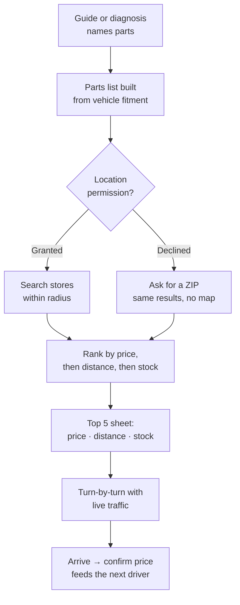

# 15. Parts Finder & Live Map

[← MindFlow](14-mindflow.md) · [Index](README.md)

A guide tells you the plug is 17 mm. Parts Finder tells you where to buy the filter,
what it costs at five places, and how to get to the cheapest one. It closes the loop
between "here's what's wrong" and "here's the part in your hand."

## The flow

## Location permission — what to actually ask for

This needs saying plainly, because getting it wrong costs an App Store rejection.

| Permission | Where SkyLink uses it | Verdict |
| --- | --- | --- |
| **While Using the App** | Parts Finder, navigation, store distances | **This is the ask.** Buying a part is deliberate — the app is open |
| **Always** | Only a future crash/breakdown auto-detect for SOS | Defensible *only* for that, requested separately, with its own screen explaining why |

Apple requires a clear, user-visible benefit for Always-on location, and reviewers reject
apps that request it for features that work fine while the app is open. Parts shopping is
exactly that kind of feature. Asking for Always here would also read as surveillance to a
user who came for an oil change.

So: `NSLocationWhenInUseUsageDescription` at launch of Parts Finder, explained before the
OS dialog. If the user declines, the feature still works — it asks for a ZIP code and
shows everything except the live map and distances-from-here.

## Ranking

Default sort is **cheapest first**, as specified. But price alone produces silly results
(a $3 saving 14 miles away), so the ranked list carries all three facts on every row and
the sort is switchable: Price · Distance · In stock now.

A store that has only *part* of the list is shown with what's missing called out
explicitly ("Filter only — no 5W-20"), because driving to a store that has half the job
is worse than driving further once.

## Hardware stores are in the list on purpose

Home Depot, Lowe's, Ace, and local hardware stores appear alongside the parts chains for
**tools and consumables** — sockets, wrenches, drain pans, funnels, gloves, shop rags,
bolts, screws, zip ties, thread locker. These are routinely cheaper there than at a parts
counter, and a first-timer doing an oil change usually needs the tools more than they
need brand choice on the filter.

They are labeled differently ("Tools only") so nobody drives to Home Depot expecting an
oil filter.

## The hard part: where prices come from

There is no universal auto-parts pricing API. AutoZone, O'Reilly, NAPA, and Advance do
not publish open public price/inventory APIs; what turns up in a search is third-party
scrapers, which are brittle, generally against those sites' terms of service, and not a
foundation to build a business on. Plan around that rather than discovering it in month
three.

Four honest sources, in order of preference:

| Source | How | Reliability |
| --- | --- | --- |
| **Affiliate / partner feeds** | Commerce affiliate programs and retailer partner APIs, where a signed agreement exists | Best. Authoritative price, sometimes stock |
| **Catalog data providers** | Licensed parts-catalog data (fitment, part numbers, MSRP) | Good for fitment and part numbers; MSRP ≠ shelf price |
| **Community-reported** | Drivers confirm the price when they arrive | Improves with usage; needs moderation |
| **User photo of a shelf tag** | OCR the tag, attach to the record | Good evidence, slow to accumulate |

**Every price in the UI carries its provenance and age.** "Store feed · 2h ago" and "Last
reported by a driver · 3 days ago" are different claims and the interface never flattens
them into one number. Tapping a price shows how it was obtained.

This is also the honest version of "the more people use it, the better it gets": the
confirmation prompt after arrival is the mechanism. It is not magic and it has a cold-start
problem — in a new city the list is catalog data and store locations, and the app should
say so rather than showing stale confidence.

## Maps and navigation — pick this deliberately

In-app turn-by-turn is the single most expensive technical decision in this feature.

| Option | Turn-by-turn in-app? | Cost | Notes |
| --- | --- | --- | --- |
| **MapKit** (Apple) | **No** | Free | Great maps, ETAs, and search. Navigation hands off to Apple Maps and leaves the app |
| **Mapbox Navigation SDK** | Yes | Usage-based, published pricing | The practical choice for in-app guidance with a free tier to start |
| **Google Navigation SDK** | Yes | Licensed, enterprise-priced | Best data. Not a self-serve signup |

The pragmatic path: **MapKit for v1** — map display, store search, distances, ETAs, and
a hand-off to Apple or Google Maps for the actual drive. It costs nothing and ships fast.
Add **Mapbox Navigation** only once Parts Finder is demonstrably used, because in-app
guidance is a nice-to-have next to knowing which store is cheapest.

Live traffic comes with whichever provider is chosen. SkyLink does not build traffic data.

## What "the map gets better" actually means

Three real mechanisms, none of them automatic:

1. **Price accuracy** — arrival confirmations, as above.
2. **Store metadata** — which locations actually stock which categories, parking, whether
   the counter will lend a tool, hours that are wrong in the map data.
3. **Fitment corrections** — a driver reporting that the listed filter didn't fit their
   trim is worth more than any catalog.

All three need moderation and a trust weighting (a user with 40 confirmed reports counts
more than a brand-new account), and all three need a privacy line: **contributions are
aggregated and never expose an individual's location history.** Write that into the
privacy policy alongside the vault commitments in [section 12](12-safety-and-ethics.md).

## Tier gating

| Capability | Free | Garage | Industry |
| --- | --- | --- | --- |
| Parts list from a guide | Yes | Yes | Yes |
| Top 5 nearby with prices | 3 lookups | Unlimited | Unlimited |
| Live map + distances | Yes | Yes | Yes |
| In-app turn-by-turn | Hand-off to Maps | Yes | Yes |
| Price history / drop alerts | No | Yes | Yes |
| Bulk / trade pricing view | No | No | Yes |

## Open questions

- [ ] Which affiliate or partner programs will actually sign — this determines whether
      prices are authoritative or community-reported at launch
- [ ] Licensed catalog data provider for fitment and part numbers
- [ ] MapKit-only v1, or go straight to Mapbox Navigation?
- [ ] Moderation model for community price reports, and the trust weighting
- [ ] Does SkyLink take affiliate revenue on parts? If so, it must be disclosed in the
      UI, and the ranking must stay honest — see the no-upselling line in
      [section 12](12-safety-and-ethics.md)
