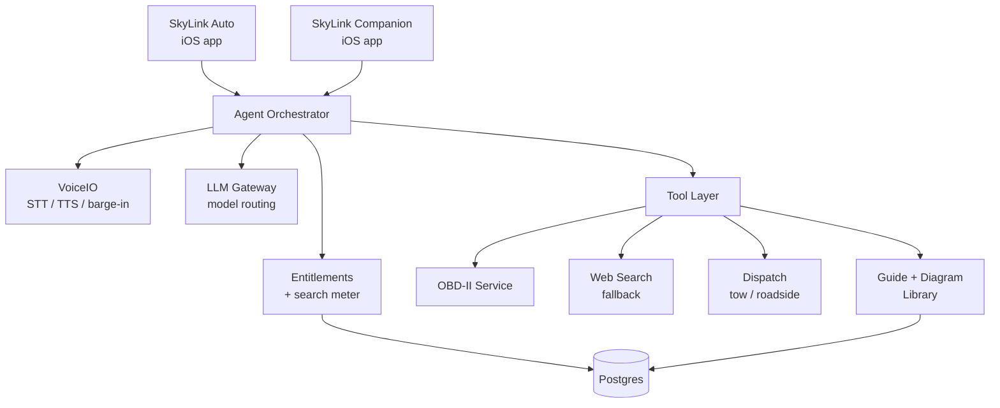
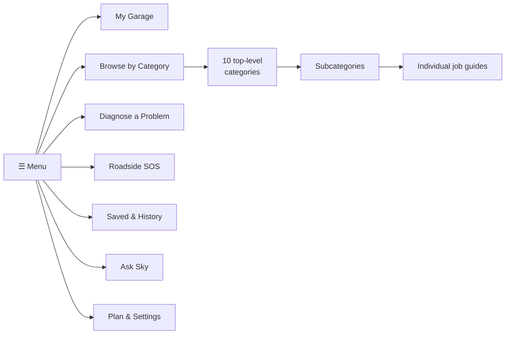
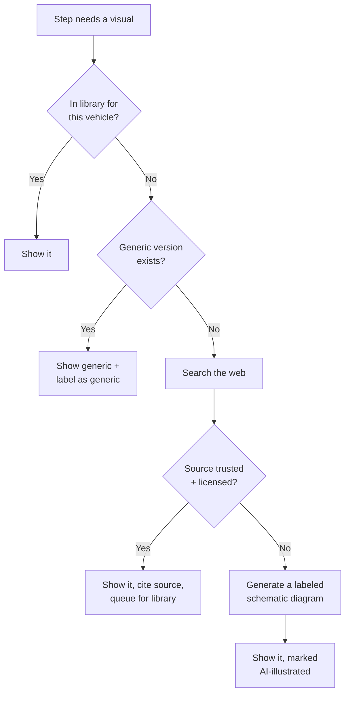
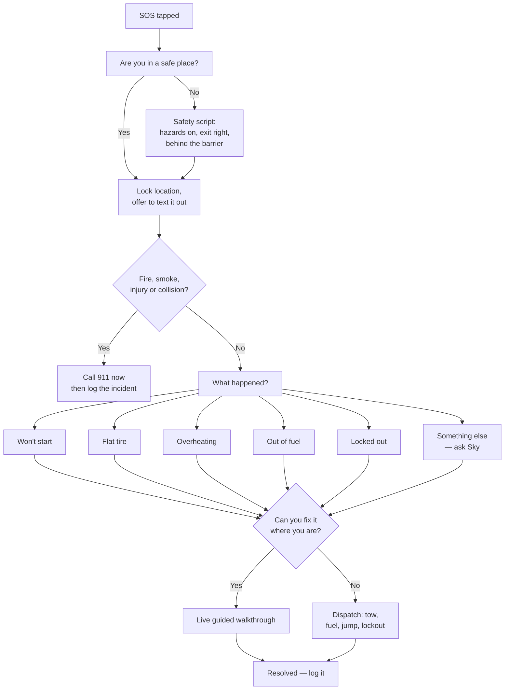
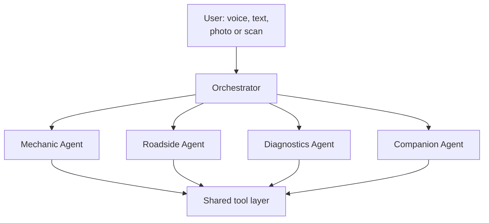
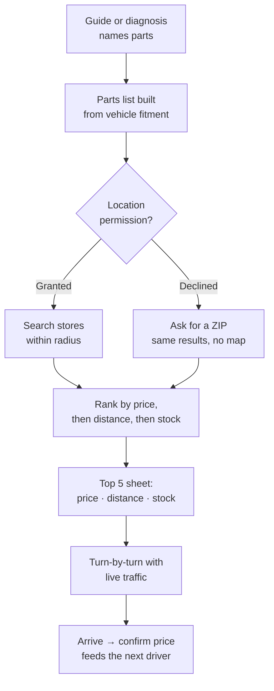

# SkyLink — Master Spec v0.1

**A mechanic in your pocket, and a companion on your screen.**

*Generated from the `docs/` directory. Do not edit this file directly — edit the
section files in `docs/` and regenerate.*

*Version 0.1 · updated 2026-09-22*

---

## Contents

- [1. Product Overview](#1-product-overview)
- [2. Platform Architecture](#2-platform-architecture)
- [3. SkyLink Auto — Navigation](#3-skylink-auto--navigation)
- [4. The Category Tree](#4-the-category-tree)
- [5. Guides & Diagrams](#5-guides--diagrams)
- [6. Roadside SOS](#6-roadside-sos)
- [7. OBD-II Diagnostics](#7-obd-ii-diagnostics)
- [8. The AI Agents](#8-the-ai-agents)
- [9. SkyLink Companion](#9-skylink-companion)
- [10. Pricing & Entitlements](#10-pricing--entitlements)
- [11. Brand System](#11-brand-system)
- [12. Safety, Liability & Ethics](#12-safety-liability--ethics)
- [13. Build Roadmap](#13-build-roadmap)
- [14. MindFlow — Personal Tracking & Voice Assistant](#14-mindflow--personal-tracking--voice-assistant)
- [15. Parts Finder & Live Map](#15-parts-finder--live-map)

---

# 1. Product Overview


SkyLink is one platform carrying two products on a shared spine.

**SkyLink Auto** — a mechanic in your pocket. A voice-first AI that walks a complete
beginner through car maintenance and roadside emergencies using labeled diagrams and
numbered steps. It assumes the user has never opened a hood, and may be standing on a
shoulder in the dark right now.

**SkyLink Companion** — a screen-aware, voice-first accessibility assistant. Reads the
screen aloud, describes photos like a friend would, navigates apps by voice, announces
calls and texts with tone.

## Why one platform

Both products need the same three things: a hands-free voice loop, an AI agent that can
see what the user sees, and a permission model the user trusts. Build that spine once.
Two app surfaces, two stories to market, one account and one backend.

The audiences also overlap more than they look. A blind driver's passenger still needs
the dashboard light explained. A user with limited mobility stranded on a shoulder needs
dispatch, not a jack. SkyLink Auto in voice mode is an accessibility product whether or
not it is sold as one.

## Who SkyLink Auto is for

| Segment | What they need | Likely tier |
| --- | --- | --- |
| Knows nothing about cars | Plain language, diagrams, "is this safe for me to do?" | Free → Garage |
| Weekend DIYer | Torque specs, job sequence, part numbers | Garage |
| Rideshare / delivery driver | Uptime — fast triage, cheap fixes, no shop downtime | Garage |
| Independent shop or fleet | Multi-vehicle records, unlimited diagnostics, no ceiling | Industry |

## The core bet

Every answer a beginner needs about their car already exists online. It is scattered
across forums, PDFs, and 14-minute videos where the useful part starts at 9:20. The
problem is not information, it is interface. SkyLink collapses "what is that noise and
am I in danger" into one spoken question and one correct, illustrated answer.

## What makes it different

- **Voice-first, not voice bolted on.** Hands dirty, hands on a lug wrench, or eyes that
  cannot read the screen. The whole flow works spoken.
- **Diagrams are the product.** Text steps are useless to someone who does not know what
  a serpentine belt looks like. Every step that names a part shows that part, highlighted.
- **It reads the car, not just the driver.** OBD-II codes arrive as structured data, so
  the agent diagnoses from the car's own signal instead of "it's making a weird sound."
- **It knows when to stop.** The agent refuses jobs that are unsafe for an untrained
  person and routes to a professional. That refusal is what makes the rest trustworthy.

## Naming

- Platform: **SkyLink** · shared account: **SkyLink ID**
- Auto product: **SkyLink Auto**, agent persona **Sky**
- Accessibility product: **SkyLink Companion**, agent persona **Halo**

---

# 2. Platform Architecture


One spine, two heads. Everything below the Agent Orchestrator is shared by both
products.



## iOS app — Swift package layout

```
/SkyLink
 /Shared
  /VoiceIO              # speech in/out, wake word, barge-in
  /AgentEngine          # turn loop, tool calls, streaming
  /PrivacyManager       # permission gates, redaction, local-only flags
  /EntitlementKit       # tier, search meter, paywall triggers
  /DesignSystem         # tokens, components, dark mode, Dynamic Type
  /LoggingService
 /Auto
  /GarageStore          # vehicle profiles, VIN decode, service history
  /GuideRenderer        # step player, diagram canvas, hotspot overlay
  /DiagramKit           # SVG layer renderer, pan/zoom, part highlight
  /OBDService           # CoreBluetooth, ELM327, PID polling, DTC decode
  /RoadsideSOS          # triage flow, location, dispatch, offline cache
  /CategoryDrawer       # the hamburger tree
 /Companion
  /ScreenCaptureService # ReplayKit / Broadcast Upload extension
  /VisionInterpreter    # on-screen element + photo description
  /OverlayGuidanceView
  /ShortcutsBridge
 /App
  /Onboarding
  /Settings
  /Paywall
```

## Backend split

**Node.js (TypeScript)** owns everything user-facing and real-time: auth, accounts,
entitlements and the search meter, subscriptions and webhooks, the agent turn API (SSE
streaming), dispatch partner integrations, and the content API for guides and diagrams.

**Python (FastAPI)** owns the AI and data work: LLM orchestration and prompt assembly,
retrieval over the guide corpus, DTC interpretation models, diagram matching and
generation, and the ingestion pipeline that turns manuals and bulletins into structured
guides.

They talk over an internal gRPC/HTTP boundary. The iOS app only ever talks to Node.

## Database schema (core tables)

Full DDL in [`/schema/schema.sql`](schema/schema.sql).

| Table | Key columns | Notes |
| --- | --- | --- |
| `users` | id, email, auth_provider, created_at | SkyLink ID |
| `subscriptions` | user_id, tier, status, period_end, store_txn_id | free / garage / industry |
| `usage_meter` | user_id, period_start, ai_searches_used, resets_at | drives the tier caps |
| `vehicles` | id, user_id, vin, year, make, model, engine, mileage, nickname | My Garage |
| `service_records` | id, vehicle_id, job_slug, performed_at, mileage, cost, notes | history |
| `categories` | id, parent_id, slug, title, icon, sort_order | the drawer tree |
| `guides` | id, category_id, slug, title, difficulty, minutes, tools[], parts[], safety_level | one job |
| `guide_steps` | id, guide_id, index, body, diagram_id, warning, checkpoint | ordered steps |
| `diagrams` | id, slug, svg_url, layers jsonb, hotspots jsonb, source, license | labeled art |
| `vehicle_fitment` | guide_id, year_from, year_to, make, model, engine | which cars a guide fits |
| `dtc_codes` | code, system, plain_title, plain_meaning, severity, common_causes[] | P0301 etc. |
| `obd_sessions` | id, vehicle_id, started_at, codes jsonb, live_pids jsonb | scan history |
| `sos_incidents` | id, user_id, vehicle_id, lat, lng, triage_path, outcome, dispatch_ref | roadside |
| `agent_turns` | id, user_id, product, tokens, tools_used[], metered bool | audit + billing |

## Cross-cutting rules

- **Offline first for safety content.** Roadside triage, the emergency checklist, and
  any guide the user has opened in the last 30 days cache on device. Cell service on a
  shoulder is not a given.
- **Metering happens server-side.** The client never decides whether a search counts.
  `agent_turns.metered` is the source of truth.
- **One permission ledger.** Microphone, location, camera, Bluetooth, screen capture —
  all requested just-in-time with a plain-language reason, all revocable in one screen,
  all logged.

---

# 3. SkyLink Auto — Navigation


The hamburger drawer slides in from the **left** (thumb-reachable on the side most
people hold with; the right edge stays clear for iOS back-swipe). Tap the icon
top-left, or say "Sky, show me the menu."

## Home screen

Three things above the fold, nothing else:

1. **The ask bar** — a big microphone with "Ask Sky anything about your car." Tap to
   talk, or type.
2. **SOS button** — red, always visible, one tap into roadside triage. Never buried in
   the drawer.
3. **Your car** — the active vehicle card: nickname, mileage, next service due, any
   active check-engine code.

Below that: Continue where you left off, then four or five suggested jobs based on the
vehicle's mileage.

## The drawer



Three levels, never four. Category → subcategory → guide. If something wants a fourth
level it is a step inside a guide, not a menu item.

### Drawer items

| Item | What it opens |
| --- | --- |
| My Garage | Vehicle list, add by VIN scan / plate / manual, service history per car |
| Browse by Category | The full maintenance tree — [section 4](#04-category-tree) |
| Diagnose a Problem | Symptom-first entry: "it won't start", "it's making a noise", or scan with OBD-II |
| Roadside SOS | Stranded flow — [section 6](#06-roadside-sos) |
| Find Parts | Cheapest parts nearby and directions — [section 15](#15-parts-finder) |
| Saved & History | Bookmarked guides, past conversations, past scans |
| Ask Sky | Full-screen chat/voice with the agent |
| Plan & Settings | Tier, searches remaining, permissions, accessibility, units |

## Vehicle context is global

Every guide, every answer, every diagram is filtered by the active vehicle. The
oil-change guide for a 2014 Corolla is not the guide for a 2021 F-150, and showing the
wrong one is worse than showing none. If no vehicle is set, the app asks for
year/make/model/engine before the first guide opens — it is the one piece of setup that
cannot be skipped.

Switching cars is a tap on the vehicle chip in the header, available from every screen.

## Search and entry points

Four ways into the same content, because people describe car problems very differently:

- **Category browse** — for "I know I need to change my oil."
- **Symptom search** — for "there's a grinding when I brake." Natural language, mapped
  to guides.
- **OBD-II scan** — for "the light came on." Code → plain meaning → candidate guides.
- **Photo** — point the camera at the engine bay, a fluid puddle, or a dash light.
  Vision model identifies and routes.

All four converge on the same guide renderer, and all four can be driven entirely by
voice.

## Accessibility baseline (non-negotiable)

- Every screen fully operable by VoiceOver and by voice command alone.
- Dynamic Type to the largest accessibility sizes without truncation.
- Every diagram carries a written long-description and a spoken walkthrough, so a blind
  user gets the same information a sighted user gets from the picture.
- Minimum 44pt touch targets; high-contrast mode; no information conveyed by color alone
  (a red warning also carries an icon and the word "Stop").

---

# 4. The Category Tree


Ten top-level categories. Each opens to subcategories; each subcategory holds
individual job guides. Difficulty is rated for someone with no experience.

Machine-readable version for seeding the database:
[`/schema/categories.seed.json`](schema/categories.seed.json).

**Difficulty scale:** 🟢 Anyone · 🟡 Some patience, basic tools · 🟠 Real tools, half a
day · 🔴 Pro only — the app explains, it does not walk you through

## 1. Fluids & Filters

| Job | Difficulty | Time | Tools |
| --- | --- | --- | --- |
| Check engine oil level | 🟢 | 3 min | Rag |
| Oil & filter change | 🟡 | 45 min | Wrench set, drain pan, jack + stands, filter wrench |
| Check / top off coolant | 🟢 | 5 min | Funnel |
| Coolant flush | 🟠 | 2 hr | Drain pan, hose, funnel |
| Brake fluid check & top-off | 🟢 | 5 min | Rag |
| Transmission fluid check | 🟡 | 15 min | Funnel, rag |
| Power steering fluid | 🟢 | 5 min | Funnel |
| Windshield washer fluid | 🟢 | 2 min | None |
| Engine air filter | 🟢 | 10 min | Screwdriver |
| Cabin air filter | 🟢 | 15 min | Usually none |
| Fuel filter replacement | 🟠 | 1 hr | Line wrenches, safety glasses |

## 2. Tires & Wheels

| Job | Difficulty | Time | Tools |
| --- | --- | --- | --- |
| Check tire pressure & inflate | 🟢 | 10 min | Gauge, compressor |
| Read tire size and date code | 🟢 | 3 min | None |
| Check tread depth (penny test) | 🟢 | 5 min | A penny |
| Change a flat to the spare | 🟡 | 30 min | Jack, lug wrench, wheel chock |
| Use a tire plug kit | 🟡 | 25 min | Plug kit, pliers |
| Rotate tires | 🟡 | 1 hr | Jack, stands, torque wrench |
| Reset TPMS light | 🟢 | 10 min | None or scan tool |
| Diagnose a vibration by speed | 🟡 | 20 min | None |
| Wheel alignment — when you need one | 🔴 | — | Shop |

## 3. Battery & Electrical

| Job | Difficulty | Time | Tools |
| --- | --- | --- | --- |
| Jump-start a dead battery | 🟡 | 15 min | Jumper cables or pack |
| Test battery health | 🟡 | 10 min | Multimeter |
| Clean corroded terminals | 🟡 | 20 min | Wire brush, baking soda |
| Replace the battery | 🟡 | 30 min | Socket set |
| Is it the battery or the alternator? | 🟡 | 15 min | Multimeter |
| Replace a blown fuse | 🟢 | 10 min | Fuse puller |
| Find the fuse box and read the map | 🟢 | 5 min | None |
| Replace headlight / taillight bulb | 🟡 | 20 min | Gloves, screwdriver |
| Starter and alternator symptoms | 🔴 | — | Shop |

## 4. Brakes

| Job | Difficulty | Time | Tools |
| --- | --- | --- | --- |
| What that squeal / grind means | 🟢 | 5 min | None |
| Inspect pad thickness through the wheel | 🟡 | 15 min | Flashlight |
| Replace front brake pads | 🟠 | 2 hr | Jack, stands, C-clamp, socket set, torque wrench |
| Replace rotors | 🟠 | 3 hr | Full brake kit |
| Bleed the brakes | 🟠 | 1 hr | Bleeder kit, helper |
| Soft or sinking pedal | 🔴 | — | Stop driving — shop |
| Parking brake adjustment | 🟠 | 1 hr | Socket set |

## 5. Engine & Performance

| Job | Difficulty | Time | Tools |
| --- | --- | --- | --- |
| Replace spark plugs | 🟠 | 1.5 hr | Plug socket, torque wrench, gap gauge |
| Replace ignition coils | 🟠 | 1 hr | Socket set |
| Serpentine belt inspection | 🟡 | 10 min | Flashlight |
| Serpentine belt replacement | 🟠 | 1.5 hr | Belt tool, socket set |
| Rough idle — what to check first | 🟡 | 30 min | None |
| Engine misfire triage | 🟡 | 30 min | Scan tool |
| Clean the throttle body | 🟠 | 1 hr | Cleaner, rags, sockets |
| Timing belt — why it matters | 🔴 | — | Shop |
| Overheating — what to do right now | 🟢 | 10 min | None |

## 6. Warning Lights & Dashboard

| Topic | Difficulty | Time |
| --- | --- | --- |
| Check engine light — solid vs flashing | 🟢 | 5 min |
| Oil pressure light — pull over now | 🟢 | 2 min |
| Temperature warning | 🟢 | 5 min |
| Battery / charging light | 🟢 | 5 min |
| ABS and traction control lights | 🟢 | 5 min |
| Airbag / SRS light | 🟢 | 5 min |
| TPMS light | 🟢 | 5 min |
| Identify any light by photo | 🟢 | 1 min |

## 7. Heating, Cooling & Comfort

| Job | Difficulty | Time |
| --- | --- | --- |
| AC blowing warm — first checks | 🟡 | 20 min |
| Recharge AC refrigerant | 🟠 | 45 min |
| Heater blowing cold | 🟡 | 20 min |
| Defroster not clearing | 🟢 | 10 min |
| Blower motor not working | 🟠 | 1 hr |
| Cabin smells (musty, sweet, burning) | 🟢 | 10 min |

## 8. Exterior, Wipers & Glass

| Job | Difficulty | Time |
| --- | --- | --- |
| Replace wiper blades | 🟢 | 10 min |
| Wiper streaking and chatter | 🟢 | 10 min |
| Fix a windshield chip | 🟡 | 30 min |
| Restore foggy headlights | 🟡 | 45 min |
| Touch up a paint scratch | 🟡 | 1 hr |
| Replace a side mirror glass | 🟡 | 30 min |

## 9. Seasonal & Preventive

| Topic | Difficulty | Time |
| --- | --- | --- |
| Winter readiness checklist | 🟢 | 30 min |
| Summer / heat readiness | 🟢 | 30 min |
| Pre-road-trip inspection | 🟢 | 45 min |
| Storing a car for months | 🟡 | 1 hr |
| Mileage service schedule (30/60/90k) | 🟢 | 10 min |
| Monthly five-minute walkaround | 🟢 | 5 min |

## 10. Roadside Emergencies

Mirrors the SOS flow in [section 6](#06-roadside-sos), browsable when you are not yet
in trouble.

| Situation | Difficulty | Time |
| --- | --- | --- |
| Car won't start — decision tree | 🟢 | 10 min |
| Flat tire on the shoulder | 🟡 | 30 min |
| Overheating on the road | 🟢 | 15 min |
| Out of fuel | 🟢 | 10 min |
| Locked out | 🟢 | 5 min |
| Stuck in snow, sand or mud | 🟡 | 30 min |
| After a minor collision | 🟢 | 20 min |
| Smoke or burning smell | 🟢 | 2 min |
| Build a trunk emergency kit | 🟢 | 30 min |

## Why this shape

Every category leads with the thing a nervous person actually needs: "what does this
mean" before "how do I replace it." Red-rated jobs still get a guide — it just explains
what is wrong, what a shop will do, and roughly what it should cost, so the user walks
in informed instead of being talked into a transmission flush they do not need.

---

# 5. Guides & Diagrams


## Anatomy of a job guide

Every guide has the same six parts, in the same order, so the user learns the shape
once.

1. **The header card** — job name, your specific vehicle, difficulty, realistic time,
   what it costs to DIY vs. at a shop.
2. **Should you do this yourself?** — one honest paragraph. Sometimes the answer is no.
3. **What you need** — tools and parts as a checkable list, each with a photo and a
   rough price. Tapping a part shows the correct part number for the active vehicle.
4. **Safety gate** — a blocking screen the user must acknowledge before step 1. Not a
   legal footnote: real, specific hazards for this job ("the engine must be cold or you
   will be burned by coolant under pressure").
5. **The steps** — one screen per step. Never a wall.
6. **Finish & verify** — how to confirm it worked, what to do with the old part, and a
   one-tap "log this to my service history."

## Anatomy of a step

One step fills one screen:

- **Diagram at the top, large.** The relevant part highlighted, everything else dimmed.
- **One sentence of instruction.** Under 20 words. "Loosen the drain plug
  counter-clockwise until it turns by hand."
- **A plain-language note** under it if the sentence needs unpacking. This is where
  "counter-clockwise means lefty-loosey" lives.
- **A warning strip** if there is a hazard, in red with an icon and the word, never
  color alone.
- **Checkpoint** — "you should now see..." so the user can confirm they are on track
  before moving on.
- **Stuck?** — one tap hands the step's full context to Sky: "the bolt won't budge."

Voice mode reads each step aloud, waits, and advances on "next" or "done." Saying
"back", "repeat", or "what does that look like" works at any point.

## Diagram standards

Diagrams are the hardest and most valuable asset in the app. They are not stock photos.

- **Layered SVG, not flat images.** Each diagram is a base illustration plus named
  layers: parts, labels, hotspots, highlight overlays. The renderer can spotlight one
  part per step from the same base art.
- **Labeled by default.** Every part a beginner would not recognize carries a leader
  line and a name.
- **Hotspots are tappable.** Tap any labeled part to hear what it does and what goes
  wrong with it.
- **Two themes.** Light and dark versions, both tested for contrast.
- **Orientation cue.** Every engine-bay diagram includes a "you are standing here"
  marker, because a picture with no orientation is useless to someone who has never
  looked at an engine.
- **Written long-description.** Every diagram has a paragraph describing it in words,
  which is both the accessibility text and what the AI reads when reasoning about the
  image.

## The fallback chain — when there is no diagram

When a step or question has no diagram in the library:



Four rules govern that chain:

- **Always say where it came from.** A library diagram, a generic diagram, a web
  source, and an AI-drawn schematic look different and are labeled differently. The
  user always knows which one they are looking at.
- **Licensing is checked before display**, not after. Manufacturer service diagrams are
  not free to redistribute; the app links out to them rather than copying them.
- **Never fabricate a torque spec, a fluid capacity, or a part number.** Those come from
  the fitment database or a cited source, or the agent says it does not have them and
  tells the user where to look (the owner's manual, the door jamb sticker, the cap
  itself).
- **Everything fetched is queued for review.** A web-sourced or AI-generated diagram
  that gets used repeatedly becomes a candidate for a real library asset. The library
  grows from real usage.

## Writing rules for "I know nothing about cars"

Enforced in the content style guide and in the agent's system prompt:

- No unexplained jargon. First use of any term gets a three-word gloss in parentheses.
- No "simply", "just", or "obviously." Nothing about a car is obvious to someone who has
  never done it.
- Direction is always absolute plus relative: "counter-clockwise (lefty-loosey), toward
  the driver's side."
- Every measurement in both units.
- If a step can be done wrong in a way that costs money, say what wrong looks like
  before the user does it.
- Reading level target: 7th grade.

---

# 6. Roadside SOS


The most important screen in the app. The user is frightened, possibly in the dark,
possibly beside moving traffic, possibly with a dying phone. Every design decision here
is subordinate to that.

## Design constraints

- **One tap from anywhere.** The SOS button is on the home screen and in the drawer, and
  is reachable by saying "Sky, I need help" from any screen.
- **Safety before diagnosis.** The app never asks what is wrong until it has told the
  user how not to get hit by a car.
- **Works offline.** The triage tree, the emergency guides, and the location capture all
  work with no signal. Only dispatch needs the network.
- **Low battery mode.** Below 15%, SOS drops to a black screen, huge text, voice only,
  and offers to send location by SMS before anything else.
- **Never blocked by a paywall.** Roadside SOS is free on every tier, forever. Metering
  a stranded person is indefensible and would be the story that kills the app.

## The flow



## Step 1 — Safety script

Before anything else, spoken and on screen in large type:

> Hazard lights on. If you can still move the car, get it fully off the road, as far
> right as possible. Then get out on the passenger side and stand behind the guardrail
> or well off the shoulder — not next to the car, and never between your car and
> traffic.

The app then asks one question: **"Are you somewhere safe now?"** Everything else waits
for that answer.

## Step 2 — Location, locked

Captures GPS, reverse-geocodes to a street address plus nearest mile marker or cross
street, and offers three one-tap actions: text my location to a contact, copy it, read
it aloud (for when the user is on the phone with someone). Location is captured even
offline and sent when signal returns.

## Step 3 — Emergency screen

One question: is there fire, smoke, injury, or has there been a collision? Yes routes
straight to a 911 call button with the address on screen to read out. The app does not
attempt to diagnose anything in that state.

## Step 4 — Triage

Six big buttons, each with an icon, each also a spoken option. "Something else" opens
Sky with the SOS context already attached — location, vehicle, battery level, and the
fact that the user is stranded, so the agent's first reply is already tuned to that.

## Step 5 — Fix it or get help

The agent makes an honest call and says it out loud. A flat tire on a flat shoulder in
daylight with a spare: walk them through it. The same flat on a narrow shoulder of a
freeway at night: do not, call a tow. That judgment uses location type, time of day,
weather, whether the user reported a safe position, and any accessibility needs on the
profile.

Guided walkthroughs in SOS mode differ from ordinary guides: larger type, voice-led, one
step at a time with no scrolling ahead, and a "traffic check" reminder every few steps.

## Step 6 — Dispatch

| Service | What it covers |
| --- | --- |
| Tow | Destination picker: home, a shop, nearest dealer |
| Jump start | Battery-only calls, cheapest option |
| Fuel delivery | Out of gas |
| Lockout | Keys in the car |
| Tire change | Spare present but user cannot or should not do it |

Integration is through a roadside-assistance API partner. The app also asks once, during
onboarding, whether the user already has AAA or coverage through their insurance or car
manufacturer — and if so, shows that number first rather than selling them a second
service.

## Step 7 — Resolution

Logged to `sos_incidents`: what happened, what fixed it, how long it took, what it cost.
Two payoffs. The user gets a record for insurance or reimbursement, and the app learns —
a car that has needed three jump starts in two months gets told, plainly, that its
battery is dying.

---

# 7. OBD-II Diagnostics


Every car sold in the US since 1996 has an OBD-II port, usually under the dash on the
driver's side. A Bluetooth dongle that reads it costs $20 to $40. This is the single
highest-leverage feature in the app: it turns "it's making a weird noise" into
structured data the agent can actually reason about.

## Hardware

SkyLink does not sell hardware at launch. It supports standard ELM327-compatible BLE
dongles and recommends two or three known-reliable models in-app. Later, a branded
**SkyLink Link** dongle is an obvious hardware play and a strong Garage-tier bundle.

## Pairing flow

1. "Find your port" — a diagram of the driver's footwell for the user's specific
   vehicle, with the port location marked.
2. Plug in, turn the key to accessory.
3. App scans for BLE devices, pairs, handshakes with the ECU.
4. Reads the VIN off the bus and auto-fills the vehicle profile — no typing
   year/make/model.
5. Confirmation screen: "Connected to your 2016 Honda Civic."

The whole thing should take under two minutes and never show a raw Bluetooth device
list.

## What it reads

| Data | What SkyLink does with it |
| --- | --- |
| Stored trouble codes (DTCs) | Plain-language meaning, severity, likely causes, matching guides |
| Pending codes | "This is about to turn your light on" — early warning |
| Freeze-frame data | Conditions when the fault happened: speed, load, temp |
| Readiness monitors | "Will this pass emissions?" — a real, common user question |
| Live PIDs | RPM, coolant temp, intake temp, fuel trims, O2 sensors, battery voltage, load |
| Mode 06 test results | Advanced; Industry tier |

## Translating a code

The user never sees a bare code as the answer. `dtc_codes` maps each one to a plain
title, a plain meaning, a severity, and common causes ordered cheapest-first. A P0301
renders as:

> **Cylinder 1 is misfiring.** One of your engine's cylinders isn't firing properly.
> You may feel shaking, or notice less power.
>
> **How urgent:** Drive gently and get this looked at soon. If your check-engine light
> is *flashing*, stop driving — a flashing light with a misfire can destroy your
> catalytic converter, which is an expensive part.
>
> **Most likely causes, cheapest first:** worn spark plug · failed ignition coil ·
> clogged fuel injector · vacuum leak · low compression
>
> **What you can check yourself:** [Replace spark plugs — 🟠 1.5 hr] [Replace ignition
> coils — 🟠 1 hr]

Severity drives the whole tone of the screen. Four levels: **Safe to drive** · **Get it
checked soon** · **Don't drive far** · **Stop driving now**.

## How codes reach the agent

A scan writes an `obd_sessions` row, and the agent's context for that conversation
carries a compact summary: vehicle, mileage, active codes with freeze-frame, and any
anomalous live values. So the user can ask "why is my car shaking" and Sky already knows
there is a P0301 with a misfire count on cylinder 1 at 2,100 RPM under load. That is the
difference between a chatbot and a diagnostic tool.

Live data is polled only while a diagnostic screen is open, and is never streamed
continuously in the background — battery, privacy, and the CAN bus all object.

## Clearing codes — handled carefully

The app can clear codes, but it argues with you first. Clearing does not fix anything;
it erases the evidence a mechanic needs and resets emissions readiness monitors, which
means failing an inspection for days afterward. So clearing sits behind a confirmation
that explains both, and the app snapshots the codes to history before wiping them. It
refuses to clear a **Stop driving now** code at all.

## Tier gating

| Capability | Free | Garage | Industry |
| --- | --- | --- | --- |
| Read + clear codes | Yes | Yes | Yes |
| Plain-language explanation | Yes | Yes | Yes |
| Live data dashboard | No | Yes | Yes |
| Freeze-frame + readiness | No | Yes | Yes |
| Scan history & trends | Last 1 | Unlimited | Unlimited |
| Mode 06, multi-vehicle fleet view | No | No | Yes |

Reading a code is free on every tier, because a person with a lit check-engine light and
no money is exactly who this app is for. The AI *conversation* about that code is what
the meter counts.

---

# 8. The AI Agents


Five agents. One orchestrator routes; four specialists do the work.

The full system prompts live in [`/agents`](agents/) as individual files, ready to
load. This page is the overview and the tool contract.



## Shared tool layer

| Tool | Purpose |
| --- | --- |
| `get_vehicle` | Active vehicle: year, make, model, engine, mileage, history |
| `search_guides` | Retrieval over the guide corpus, filtered by fitment |
| `get_guide` / `get_step` | Pull a guide or a single step |
| `find_diagram` | Library lookup, then the fallback chain in [section 5](#05-guides-and-diagrams) |
| `web_search` | Licensed, cited external lookup |
| `read_obd` / `decode_dtc` | Live scan and code translation |
| `get_location` | Coarse or precise, permission-gated |
| `dispatch_service` | Tow, jump, fuel, lockout — always user-confirmed |
| `log_service_record` | Write to history |
| `escalate_to_human` | Hand off to a partner shop or advisor (Industry) |

## The agents

| Agent | File | Role |
| --- | --- | --- |
| Orchestrator | [`agents/orchestrator.md`](agents/orchestrator.md) | Routes to a specialist; answers nothing itself |
| Mechanic (Sky) | [`agents/mechanic.md`](agents/mechanic.md) | Maintenance, repair, how-to, guide walkthroughs |
| Roadside | [`agents/roadside.md`](agents/roadside.md) | Stranded users. Safety first, then triage, then dispatch |
| Diagnostics | [`agents/diagnostics.md`](agents/diagnostics.md) | Codes, freeze-frame, live data, urgency |
| Companion (Halo) | [`agents/companion.md`](agents/companion.md) | Screen reading, photo description, voice navigation |

Every agent inherits the [safety kernel](agents/safety-kernel.md), which is
non-overridable.

## Routing rules

- Route to **Roadside** whenever the user is or may be stranded, in traffic, or
  describes anything alarming: smoke, fire, a collision, a loss of steering or brakes.
  When in doubt between Roadside and anything else, choose Roadside.
- Route to **Diagnostics** when a code, a warning light, or live vehicle data is
  involved.
- Route to **Mechanic** for maintenance, repair, and how-to.
- Route to **Companion** for screen reading, navigation, and non-car accessibility.

Always attach the active vehicle, the user's stated experience level, any accessibility
settings, and any open OBD session to the specialist's context.

---

# 9. SkyLink Companion


The accessibility product, carried over from the HaloFlow spec and rebuilt on the shared
spine.

## Principles

- Accessibility is first-class, not a settings screen.
- Narration is human, not robotic. It describes; it does not enumerate.
- No screen control without explicit permission, every time the scope widens.

## Screen-takeover assistant

Reads the screen aloud in natural sentences. Describes photos the way a friend would,
not as an alt-text generator: who is in it, where it looks like, what is happening, what
the mood of it is. Navigates apps on spoken instruction. Announces incoming calls,
texts, and notifications with the tone of the message, not just its words.

## Who it serves

| Group | What Companion does |
| --- | --- |
| Blind and low-vision | Full photo description, tone-aware message reading, real-time announcements |
| Limited mobility | Complete hands-free navigation; every action reachable by voice |
| Neurodivergent | Reduced cognitive load mode: fewer elements, one thing at a time, no timed interactions |
| Situationally limited | Driving, cooking, carrying a child, or under a car |

## Architecture

Companion uses `ScreenCaptureService` (ReplayKit broadcast extension),
`VisionInterpreter`, `VoiceIO`, `AgentEngine`, and `PrivacyManager` from the shared
layer. The Halo persona and the overlay guidance view are the only Companion-specific
pieces above the spine.

## Permission flow

Four states, and the user can see and revoke the current one at any moment:

1. **Off** — nothing captured.
2. **Ask each time** — Halo requests a look at the screen and waits.
3. **Session** — granted until the user says stop or the app backgrounds.
4. **Always for this app** — scoped to named apps only, never blanket.

Halo announces what it is about to do before doing it, and stops instantly on "stop."
Screen content is processed for the turn and not retained unless the user asks to save
something.

## Onboarding

Four flows, carried from the HaloFlow spec: welcome and identity, permissions setup,
meet your companion, and a first task the user actually completes so the thing proves
itself in the first two minutes.

## Where the two products meet

Companion is how a blind user runs SkyLink Auto. The diagram long-descriptions written
for the guide library are exactly what Halo reads aloud. A user who cannot see the
dashboard can point the camera at it and be told which light is lit and what it means.
Neither product needed a special case for this; it falls out of sharing the spine.

---

# 10. Pricing & Entitlements


Three tiers. Prices below are a recommendation, not a decision.

| | **Free** | **Garage** | **Industry** |
| --- | --- | --- | --- |
| Price | $0 | $9.99 / mo | $39.99 / mo |
| Annual | — | $79 (save 34%) | $349 (save 27%) |
| AI searches | 20 total | 150 / month | Unlimited |
| Vehicles | 1 | 3 | Unlimited |
| Guide library | Preview — ~15 starter guides | Full library | Full library |
| Diagrams | Generic only | Vehicle-specific | Vehicle-specific + exploded views |
| Roadside SOS | **Full access** | **Full access** | **Full access** |
| OBD-II code read | Yes | Yes | Yes |
| Live OBD data | No | Yes | Yes |
| Scan history | Last 1 | Unlimited | Unlimited + fleet trends |
| Service history log | No | Yes | Yes + export |
| Offline guide cache | 3 guides | 30 days of opened guides | Everything |
| Voice mode | Yes | Yes | Yes |
| Photo diagnosis | 3 total | Unlimited | Unlimited |
| Web-search fallback | No | Yes | Yes |
| Human escalation | No | No | Yes |
| Multi-user / shop seats | No | No | Up to 10 |
| Future updates | Core only | Core only | Everything, included |

## Two things that are free forever

**Roadside SOS**, on every tier, with no meter. Someone stranded on a shoulder must
never see a paywall. It is also the best marketing the app will ever have.

**Reading a check-engine code.** The scan and the plain-language explanation are free.
What the meter counts is the open-ended conversation about it.

## What counts as an "AI search"

One metered unit = one question answered by an agent, including all its tool calls and
follow-up turns within that thread for 10 minutes. Asking three clarifying questions
about the same problem is one search, not four — anything else punishes exactly the
beginner this app is for.

**Not metered:** browsing categories, opening a guide, stepping through a guide, reading
a stored code, roadside SOS in any form, and anything the agent got wrong (a thumbs-down
refunds the search).

The meter is enforced server-side on `agent_turns.metered`. Free tier's 20 are lifetime,
not monthly, and the count is always visible: "14 of 20 left" in the header, never a
surprise.

## The upgrade moments

Four places where a free user hits the wall and the upgrade is obviously worth it,
designed rather than accidental:

1. **The 5th search.** A banner, not a block: "15 left. Garage gives you 150 a month."
2. **A vehicle-specific diagram.** Free shows the generic version with the specific one
   blurred behind an upgrade tap. This is the single strongest converter — the value gap
   is visible in one glance.
3. **The second car.** Adding a spouse's or kid's car.
4. **The last search.** Full-screen, honest: "That was your last free search. You've
   asked about your Civic 20 times — Garage is $9.99."

## Billing notes

Apple in-app purchase with StoreKit 2 (Apple takes 15–30%; price accordingly).
Subscription state is verified server-side via App Store Server Notifications, never
trusted from the client. Seven-day free trial on Garage. Industry offers annual
invoicing for shops that will not put a business subscription on a personal Apple ID.

---

# 11. Brand System


Machine-readable tokens: [`/design/tokens.json`](design/tokens.json).

## Name and mark

**SkyLink.** The link is the point: between a driver and a mechanic's knowledge,
between a phone and a car's computer, between someone stranded and someone who can
help.

Mark: a single unbroken link form that also reads as a road curving to a horizon. Clean,
geometric, legible at 20pt on a dashboard mount. Two lockups — mark alone for the app
icon, mark plus wordmark for everything else. Sub-brands are the wordmark plus a
lighter-weight "Auto" or "Companion."

## Palette

Carried from the HaloFlow palette, extended for the states a car app needs.

| Token | Hex | Use |
| --- | --- | --- |
| Signal Teal | `#3CE0C9` | Primary action, active state, brand accent |
| Midnight | `#0A0F1A` | Dark-mode ground, text on light |
| Silver | `#DDE5E8` | Light-mode ground, dividers, dimmed diagram layers |
| Coral | `#FF7A6A` | Warnings, "get it checked soon" |
| Stop Red | `#E03C3C` | SOS button, "stop driving now" |
| Caution Amber | `#F2B138` | "Don't drive far", pending codes |
| Safe Green | `#3CCB7F` | "Safe to drive", completed steps |

Dark mode is the default. People use this app in engine bays, in parking garages, and on
shoulders at night, and a white screen at 2am is hostile.

Severity color is never the only signal. Every state carries an icon and a word.

## Typography

Geometric sans for the wordmark. In-app, SF Pro (system) so Dynamic Type works properly
at every accessibility size. Step instructions set at a minimum of 20pt, and SOS text at
28pt minimum. Tabular figures for torque specs, capacities, and pressures.

## Illustration style for diagrams

This matters more than the logo, because the diagrams are what the product actually is.

- **Technical-clean line art**, not photorealism and not cartoon. Think a well-drawn
  service manual, redrawn for a phone.
- **Two-weight line system.** Heavy outline on the part in focus, light outline on
  everything else.
- **One accent color per diagram** (Signal Teal) for the part currently under
  discussion. Everything else is greyscale. Attention is the whole job.
- **Labels outside the art** with leader lines, so they never cover the thing they name.
- **Consistent viewpoint** across a category: every engine-bay diagram drawn from the
  same standing position, so the user builds a mental map instead of re-orienting each
  time.
- **Hand for scale** where size matters, and a visible orientation marker on every
  diagram.

## Voice and tone

Calm, direct, competent. The tone of a good mechanic who is not trying to sell you
anything.

- Never condescending. Not knowing how a car works is the normal condition, not a
  deficiency.
- Never alarmist, but never soft about real danger either. "Stop driving" means stop
  driving.
- Never salesy inside a task. The paywall is honest and appears at boundaries, never
  mid-repair and never in SOS.
- Short sentences. Plain words. Specifics over adjectives.

## Founder note

> Everyone has a car. Almost nobody has someone to ask about it. That's not a knowledge
> problem, it's an access problem. SkyLink is built so that the person with no money, no
> tools, and no uncle who's good with cars gets the same answer as everyone else.

---

# 12. Safety, Liability & Ethics


> **Read this before writing agent or guide code.** An app that tells people how to work
> on brakes carries real risk. This section is a build requirement, not boilerplate.

## The hard-stop list

The agent never walks an untrained user through:

- Airbag or SRS components
- High-voltage hybrid or EV systems (orange cables)
- Fuel system work under pressure
- Brake hydraulic line or master cylinder replacement
- Suspension spring compression
- Anything requiring the car to be lifted without jack stands
- Steering component removal
- Welding, cutting, or anything involving fuel and heat together

For each of these the app still gives a guide — what is wrong, why it is dangerous, what
a shop will do, and the rough cost range. Informed, not abandoned.

## Forced escalation

The agent stops and says "call a professional" when the user describes brake failure or
a sinking pedal, steering loss or a heavy pull, smoke or a burning smell, fuel smell, a
flashing check-engine light, overheating that returns after cooling, or any airbag or
SRS light. These are pattern-matched on the user's own words before any diagnosis
begins.

## Data accuracy

| Data type | Source of truth | If unavailable |
| --- | --- | --- |
| Torque specs | Fitment database, cited | Say so, point to the manual |
| Fluid capacities & types | Fitment database, cited | Point to the cap or manual |
| Part numbers | Fitment database | Point to the parts counter with the VIN |
| Service intervals | Manufacturer schedule | Point to the manual |
| Repair costs | Regional averages, given as a range | Say costs vary |

Never generated, never estimated, never inferred from a similar model. A wrong torque
spec strips a bolt or drops a wheel.

## Disclaimers that actually work

One clear disclaimer at onboarding, in plain language, that the user reads once and
understands: SkyLink gives information and guidance, not a professional inspection; the
user is responsible for deciding what they attempt; if anything feels wrong or beyond
them, stop and call a mechanic.

Then job-specific safety gates at the point of risk, where they are actually read —
rather than a wall of legal text nobody sees. Legal counsel should review the terms, the
safety gates, and the dispatch partner agreements before launch.

## Privacy

- **Location** is captured for SOS and dispatch only, never tracked in the background,
  and deleted after the incident unless the user saves it.
- **Vehicle data** including the VIN belongs to the user, is exportable, and is never
  sold or shared with insurers, lenders, or advertisers. Write that commitment into the
  privacy policy — it is a real and valuable line to hold, and competitors will not hold
  it.
- **Screen capture** in Companion is processed per turn and not retained.
- **Photos** are processed and discarded unless attached to a saved service record.
- **Conversations** are retained for the user's history and deleted on request.

## Ethics charter

- No hacking, bypassing security, or defeating immobilizers, anti-theft, or odometers.
- No scraping private data; no unauthorized payments.
- Defensive security only.
- No guidance that defeats an emissions control or safety system.
- Humanitarian bias: the free tier must be genuinely useful, and safety features are
  never metered.
- Transparency: cite sources, mark AI-generated diagrams, never present a guess as a
  fact.
- No dark patterns in the paywall. No fake urgency, no hidden cancellation.
- No upselling repairs. The app has no financial interest in the user needing work done,
  and that independence is the whole basis of its credibility.

---

# 13. Build Roadmap


Build SkyLink Auto first. It is the sharper product, the clearer market, and the faster
path to revenue. Companion follows once the spine is proven.

## MVP — one product, one promise

The promise: *ask a question about your car, get a correct illustrated answer.*
Everything not serving that is cut.

**In scope:**

- iOS only. One vehicle per user.
- Home, drawer, category browse, guide renderer, Ask Sky.
- **25 guides**, not 200. The most-searched jobs: oil, battery, flat tire, wipers, brake
  noise, dead start, overheating, coolant, air filter, jump start, tire pressure,
  warning lights.
- **Every one of those 25 fully illustrated.** Depth over breadth. A beautiful guide
  with a great diagram beats fifty text stubs, and the diagrams are the moat.
- Mechanic agent with the guide-retrieval and diagram tools.
- Roadside SOS — the full flow. Free, offline-capable. This ships in the MVP because it
  is the reason people download and the reason they tell someone else.
- Free and Garage tiers.

**Out of scope for MVP:** OBD-II, Companion, Android, photo diagnosis, dispatch
integration (SOS shows saved numbers and 911 instead), Industry tier.

## After MVP

| Release | What lands | Why then |
| --- | --- | --- |
| v1.1 | OBD-II pairing, code reading, live data | The strongest differentiator; needs real users to tune |
| v1.2 | Dispatch partner integration | Requires partner contracts and volume to negotiate |
| v1.3 | Photo diagnosis, guide library to ~150 | Content scales once the ingestion pipeline works |
| v1.4 | Parts Finder + map (MapKit), hardware-store coverage | Needs partner price feeds signed first |
| v2.0 | Industry tier, multi-vehicle fleet, shop seats | Sell to shops only once the consumer product is proven |
| v2.1 | SkyLink Companion | The accessibility product on the proven spine |
| v2.2 | Android | After iOS economics are known |

## What to hand a developer first

In this order:

1. **The data model** — [section 2](#02-architecture)'s schema. Everything else
   depends on the shape of `guides`, `guide_steps`, `diagrams`, and `vehicle_fitment`.
2. **The guide renderer and DiagramKit** — the hardest UI in the app and the thing the
   whole product is judged on. Build it against two hand-authored guides before writing
   any content pipeline.
3. **The agent layer** — [section 8](#08-ai-agents)'s prompts and the shared tool
   definitions.
4. **Entitlements and the meter** — server-side from day one; retrofitting metering is
   painful.
5. **SOS** — last to build, but it must be in the first ship.

## The real risk

It is not the AI and it is not the app. It is **content**. Twenty-five genuinely good
illustrated guides, each vehicle-accurate, is weeks of work by someone who knows cars
and someone who can draw. Start that in parallel with engineering on day one, not after.
An app with a brilliant agent and no diagrams is a chatbot, and there are plenty of
those.

## Open questions

- [ ] Who authors and reviews the guide content — a hired mechanic, a partnership, or
      licensed data?
- [ ] Which roadside-assistance API partner, and what do the economics look like?
- [ ] Does the Industry tier get sold self-serve, or does it need a sales motion?
- [ ] Is SkyLink Link (branded dongle) a v1.1 bundle or a separate hardware effort?
- [ ] Final pricing — the numbers in [section 10](#10-pricing) are a recommendation.

---

# 14. MindFlow — Personal Tracking & Voice Assistant


MindFlow extends **Ask Sky** from "ask about your car" to "ask about your life." Same
voice control, same agent spine, same approval model — a new domain.

> **Read first:** there is no codebase to inspect yet. SkyLink is at specification
> stage; this repo contains no application code. The instruction to "inspect the
> existing codebase and reuse its architecture" is therefore answered by the
> architecture in [section 2](#02-architecture), which MindFlow is designed against.
> When code exists, this section gets revisited against it.

## What is buildable, and what is not

Honest assessment before anything else.

| Capability | Status | Needs |
| --- | --- | --- |
| Onboarding, manual tracking, dashboard | Buildable now | Nothing beyond the planned stack |
| Push-to-talk, transcript, propose–approve loop | Buildable now | Speech framework + LLM gateway (already in the spine) |
| Authenticated sync, offline queue, conflict handling | Buildable now | Backend work |
| Client-side encrypted vault | Buildable now | Crypto review before shipping |
| Apple Calendar (EventKit) | Native iOS only | Calendar permission |
| Google Calendar | Buildable | Google Cloud project, OAuth client, consent screen verification |
| HealthKit | Native iOS only | Apple health entitlement, permission |
| Siri, App Intents, Shortcuts | Native iOS only | App Intents implementation |
| Home Screen & Lock Screen widgets | Native iOS only | WidgetKit; see the widget section below |
| Live Activities / Dynamic Island | Native iOS only | ActivityKit |
| Bank connections | Buildable | A banking-data provider account (Plaid or equivalent), server-side token storage |
| Social-media metrics | Partial | Per-platform API access and app review; manual entry is the fallback |
| Push notifications | Buildable | APNs key, a scheduling service |

**Not possible on any platform, and not promised anywhere in the product:** arbitrary
screen tapping, reading other apps' private data, or "control of your entire phone."
Third-party actions go through authorized APIs, Shortcuts, or a user-mediated handoff.
There is no "access your entire phone" permission and the UI must never imply one.

## 1. Guided onboarding

Four steps, each with a progress indicator, back navigation, and a skip on every
optional connection.

**Step 1 — Your priorities.** Preferred name, timezone, and which of Habits, Money,
Health, Social Growth, and Goals to track. Saved to the account; changeable later.

**Step 2 — Permissions and connections.** Each permission is explained in plain language
*before* the OS dialog appears: what is accessed, why, where it goes, how to revoke it.
Requested individually, only when needed, and only after a user action. Notifications,
microphone, calendars, and eligible health integrations. Declining any of them leaves
manual entry and typed commands fully working. A permissions page lists every
integration with its status and a disconnect button.

**Step 3 — Private vault.** The user sets their own vault passphrase. The screen states
plainly that **account sign-in and vault decryption are different things**: signing in
does not unlock the vault, and the vault protects only what is marked private. Backup,
recovery, and the consequence of losing the passphrase — the data cannot be recovered —
are stated before the passphrase is set, not after.

**Step 4 — Voice and action tutorial.** The user dictates or types one request. The app
shows the transcript, shows the proposed action, waits for approval, executes, confirms,
and links to the record created. The tutorial uses the real loop, not a simulation.

## 2. Personal dashboard

- Daily habits, recurring routines, streaks, completion history
- Spending entries, categories, budgets, savings goals
- User-entered health metrics; optional supported health connections
- Social-media metrics from authorized APIs, manual entry as fallback
- Goals, milestones, deadlines, progress
- Today's tasks, upcoming calendar events, recent-activity feed

Every connected panel shows **its source and last-updated time**. Four visually distinct
states, never blurred together:

| State | Meaning | Treatment |
| --- | --- | --- |
| Live | Fetched from an authorized API within the freshness window | Normal |
| Manual | The user typed it | Marked "entered by you" |
| Stale | Connection alive, data older than the window | Timestamp in amber + refresh |
| Demo | Sample content, no real connection | Persistent "Sample data" badge |

**Sample data is never presented as live information.** Demo state carries its badge on
every surface it appears, widgets included.

Sync across web and mobile for authenticated users, with an offline queue, idempotency
keys on every mutation to survive retries, and last-write-wins with a visible conflict
prompt when two clients edited the same record.

## 3. Voice assistant and AI actions

A visible push-to-talk control with five states: listening, processing, review, success,
error.

Example requests: *"Add a habit to walk every morning." · "Log twelve dollars for
lunch." · "Show my progress this week." · "Schedule a thirty-minute workout tomorrow at
seven." · "Move my weekly review to Friday."*

**Transcription.** The UI states where it happens — on-device where the platform
supports it, otherwise named external provider. **Raw audio is not retained by default.**
Capture stops when the user stops, leaves the feature, or backgrounds the app.

**The loop.** Transcript (editable) → proposed action → approval → execution → result
with a link to the record. Detailed in [`agents/mindflow.md`](agents/mindflow.md).

**Authorization.** Requests are routed through narrowly scoped, allowlisted tools with
validated arguments. The server checks the user's authorization before every action.
Imported content and model output are untrusted data, never authorization.

**Explicit approval required** for calendar changes, messages, purchases, financial
actions, deletions, and sharing private information. Each approval is bound to the exact
proposed action (hash of the tool call), and carries an idempotency key so a double-tap
or a retry cannot execute it twice.

Action history with undo where the underlying operation supports it.

**Initial release scope:** creating tasks, logging habits, recording expenses,
summarizing progress. Money transfers and purchases are not enabled.

## 4. Apple and phone integrations

**Native iOS.** Permission requests through supported Apple frameworks. Eligible
MindFlow actions exposed as App Intents so Siri and Shortcuts can invoke them. Calendar,
notification, and health APIs at minimum necessary scope. Device secrets in Keychain.

**Web.** Browser microphone and notification APIs. Unsupported features are detected and
the alternative is explained. The website never claims native Siri, HealthKit, or phone
control.

## 5. Live dashboard: widgets, Lock Screen, and Siri

This is the "live AI assistant on your phone" the product promises, built out of what
iOS actually offers.

| Surface | Framework | What it shows / does |
| --- | --- | --- |
| Home Screen widget | WidgetKit | Today's habits with streaks, spend vs. budget, next event. Small / medium / large. |
| Lock Screen widget | WidgetKit accessory families | One glanceable metric: streak, remaining budget, or next event |
| Interactive widget | WidgetKit + App Intents | Tick a habit or log a preset expense **from the widget**, no app launch |
| Live Activity / Dynamic Island | ActivityKit | An in-progress routine, workout, or focus block with a live timer |
| Siri / Shortcuts | App Intents | "Hey Siri, log my walk in SkyLink." Runs the same allowlisted tool |
| Control Center control | ControlWidget | One-tap push-to-talk into Ask Sky |
| Notifications | UserNotifications + APNs | Reminders, quiet hours, categories |

Constraints to design against, rather than discover later:

- Widgets are **timeline snapshots**, not live-streaming views. They refresh on a
  budgeted schedule plus on push. Design for "recently accurate," and stamp the time.
- Widget content must respect the vault: locked private data is **not** rendered in a
  widget. Show a locked placeholder instead.
- Lock Screen surfaces show no balances, transaction details, or health values by
  default.
- Interactive widgets can run App Intents, but anything requiring approval (calendar
  writes, deletions) opens the app for the approval step rather than executing inline.
- Siri invocations still run the propose–approve loop for anything on the explicit-
  approval list. Siri is an entry point, not a bypass.

## 6. Secure cloud and private data

- Authenticated access, strict per-user authorization on every read and write.
- **Each user controls their own vault credentials. There is no universal decryption
  password held by the app owner.**
- Private vault content is encrypted **on the client** before upload.
- Established crypto libraries and authenticated encryption. No custom cryptography.
- Vault passwords, keys, and plaintext vault content are never sent to the server and
  never logged.
- TLS everywhere, secrets in a managed store, rate limits, privacy-conscious logging.
- Automatic vault locking, encrypted backups, account export, account deletion.
- Documentation of what encryption does *not* protect: an unlocked device, a compromised
  device, and anything the user chose not to mark private.

### The tradeoff, stated rather than hidden

A server cannot process locked data without access to its decryption key. So background
automation and server-side AI cannot operate on end-to-end encrypted content. MindFlow
does not quietly weaken encryption to make background features work. Instead, each data
class is labeled:

| Class | Example | Where it lives |
| --- | --- | --- |
| End-to-end encrypted | Journal entries, anything marked private | Client-encrypted; server stores ciphertext only |
| Backend-processed | Habits, tasks, budgets, goals, metrics | Encrypted at rest, readable by the backend for sync, summaries, reminders |
| Shared with integrations | Calendar events, bank transactions, social metrics | Governed by that provider's scope |

Sending any decrypted content to a cloud AI provider requires separate, explicit consent
for that send.

## 7. Bank connections

Through a reputable banking-data provider's **official hosted authorization flow**.

- **The app never builds a form that collects bank passwords.** Not once, not anywhere.
- Request only account and transaction scope, and only what tracking needs.
- Provider secrets and long-lived tokens stay server-side, never in a browser or mobile
  bundle.
- Validate provider callbacks and webhooks (signature + replay protection).
- Users can disconnect an account and are told what is retained and what is deleted.
- Banking-provider access is separate from the private vault, and the UI says so.
- Manual expense entry is always available and is the default with no bank connected.

## 8. Notifications

Configurable reminders, quiet hours, timezone, and categories. Sensitive balances,
transaction details, and health information stay **off the Lock Screen by default**.

Permission is not delivery: APNs, a scheduling service, and retry handling are real
backend work and must be implemented and tested, not assumed.

## 9. Design

MindFlow fits inside SkyLink's shell. Where a distinct MindFlow identity is appropriate:

| Token | Hex |
| --- | --- |
| Cream | `#FBF4E4` |
| Tinted cream | `#F2E8D2` |
| Ink | `#17170F` |
| Electric blue | `#1B3BE0` |
| Orange | `#FF5A2B` |
| Yellow on blue surfaces | `#FFD34E` |

Type: **Anton** for display headings · **Instrument Serif italic** for expressive
heading accents · **Chivo** for body · **Chivo Mono** for labels and data.

Warm backgrounds, clear hierarchy, restrained accents, accessible contrast, responsive
layouts, keyboard support, visible focus states, reduced-motion support. Every screen
ships with loading, empty, permission-denied, offline, and error states.

Note the collision with SkyLink Auto's dark-first palette
([section 11](#11-brand)): MindFlow is the warm, light surface inside a dark app. That
is a deliberate contrast, and the boundary between the two needs a designed transition
rather than an abrupt swap.

## 10. Phases and acceptance

| Phase | Scope |
| --- | --- |
| 1 | Onboarding, manual tracking, dashboard, permissions UI |
| 2 | Dictation, transcript editing, propose–approve loop, internal actions |
| 3 | Authenticated persistence, sync, offline queue, private vault |
| 4 | Calendar, notifications, banking, widgets, App Intents, Live Activities |

### Test matrix

- Permission states: granted, denied, revoked mid-session, unsupported platform
- Vault: correct passphrase decrypts; wrong passphrase and tampered ciphertext are
  rejected, distinctly
- Cross-user access denial on every endpoint
- Voice: review, edit, cancel, approve, and duplicate-execution prevention
- Calendar: timezone correctness, DST boundaries, recurrence, sync conflicts, expired
  permission
- Offline: queue, recovery, idempotent retry
- Logs: no vault passwords, keys, plaintext vault content, or tokens
- Widgets: locked-vault placeholder, stale timestamps, demo badge
- Mobile responsiveness and accessibility

### Definition of done

Working code, setup instructions, required environment variables listed **without
values**, tests, and a maintained list of implemented vs. unavailable features. The
product is not described as production-secure or fully integrated until that has been
verified by review.

---

# 15. Parts Finder & Live Map


A guide tells you the plug is 17 mm. Parts Finder tells you where to buy the filter,
what it costs at five places, and how to get to the cheapest one. It closes the loop
between "here's what's wrong" and "here's the part in your hand."

## The flow



## Location permission — what to actually ask for

This needs saying plainly, because getting it wrong costs an App Store rejection.

| Permission | Where SkyLink uses it | Verdict |
| --- | --- | --- |
| **While Using the App** | Parts Finder, navigation, store distances | **This is the ask.** Buying a part is deliberate — the app is open |
| **Always** | Only a future crash/breakdown auto-detect for SOS | Defensible *only* for that, requested separately, with its own screen explaining why |

Apple requires a clear, user-visible benefit for Always-on location, and reviewers reject
apps that request it for features that work fine while the app is open. Parts shopping is
exactly that kind of feature. Asking for Always here would also read as surveillance to a
user who came for an oil change.

So: `NSLocationWhenInUseUsageDescription` at launch of Parts Finder, explained before the
OS dialog. If the user declines, the feature still works — it asks for a ZIP code and
shows everything except the live map and distances-from-here.

## Ranking

Default sort is **cheapest first**, as specified. But price alone produces silly results
(a $3 saving 14 miles away), so the ranked list carries all three facts on every row and
the sort is switchable: Price · Distance · In stock now.

A store that has only *part* of the list is shown with what's missing called out
explicitly ("Filter only — no 5W-20"), because driving to a store that has half the job
is worse than driving further once.

## Hardware stores are in the list on purpose

Home Depot, Lowe's, Ace, and local hardware stores appear alongside the parts chains for
**tools and consumables** — sockets, wrenches, drain pans, funnels, gloves, shop rags,
bolts, screws, zip ties, thread locker. These are routinely cheaper there than at a parts
counter, and a first-timer doing an oil change usually needs the tools more than they
need brand choice on the filter.

They are labeled differently ("Tools only") so nobody drives to Home Depot expecting an
oil filter.

## The hard part: where prices come from

There is no universal auto-parts pricing API. AutoZone, O'Reilly, NAPA, and Advance do
not publish open public price/inventory APIs; what turns up in a search is third-party
scrapers, which are brittle, generally against those sites' terms of service, and not a
foundation to build a business on. Plan around that rather than discovering it in month
three.

Four honest sources, in order of preference:

| Source | How | Reliability |
| --- | --- | --- |
| **Affiliate / partner feeds** | Commerce affiliate programs and retailer partner APIs, where a signed agreement exists | Best. Authoritative price, sometimes stock |
| **Catalog data providers** | Licensed parts-catalog data (fitment, part numbers, MSRP) | Good for fitment and part numbers; MSRP ≠ shelf price |
| **Community-reported** | Drivers confirm the price when they arrive | Improves with usage; needs moderation |
| **User photo of a shelf tag** | OCR the tag, attach to the record | Good evidence, slow to accumulate |

**Every price in the UI carries its provenance and age.** "Store feed · 2h ago" and "Last
reported by a driver · 3 days ago" are different claims and the interface never flattens
them into one number. Tapping a price shows how it was obtained.

This is also the honest version of "the more people use it, the better it gets": the
confirmation prompt after arrival is the mechanism. It is not magic and it has a cold-start
problem — in a new city the list is catalog data and store locations, and the app should
say so rather than showing stale confidence.

## Maps and navigation — pick this deliberately

In-app turn-by-turn is the single most expensive technical decision in this feature.

| Option | Turn-by-turn in-app? | Cost | Notes |
| --- | --- | --- | --- |
| **MapKit** (Apple) | **No** | Free | Great maps, ETAs, and search. Navigation hands off to Apple Maps and leaves the app |
| **Mapbox Navigation SDK** | Yes | Usage-based, published pricing | The practical choice for in-app guidance with a free tier to start |
| **Google Navigation SDK** | Yes | Licensed, enterprise-priced | Best data. Not a self-serve signup |

The pragmatic path: **MapKit for v1** — map display, store search, distances, ETAs, and
a hand-off to Apple or Google Maps for the actual drive. It costs nothing and ships fast.
Add **Mapbox Navigation** only once Parts Finder is demonstrably used, because in-app
guidance is a nice-to-have next to knowing which store is cheapest.

Live traffic comes with whichever provider is chosen. SkyLink does not build traffic data.

## What "the map gets better" actually means

Three real mechanisms, none of them automatic:

1. **Price accuracy** — arrival confirmations, as above.
2. **Store metadata** — which locations actually stock which categories, parking, whether
   the counter will lend a tool, hours that are wrong in the map data.
3. **Fitment corrections** — a driver reporting that the listed filter didn't fit their
   trim is worth more than any catalog.

All three need moderation and a trust weighting (a user with 40 confirmed reports counts
more than a brand-new account), and all three need a privacy line: **contributions are
aggregated and never expose an individual's location history.** Write that into the
privacy policy alongside the vault commitments in [section 12](#12-safety-and-ethics).

## Tier gating

| Capability | Free | Garage | Industry |
| --- | --- | --- | --- |
| Parts list from a guide | Yes | Yes | Yes |
| Top 5 nearby with prices | 3 lookups | Unlimited | Unlimited |
| Live map + distances | Yes | Yes | Yes |
| In-app turn-by-turn | Hand-off to Maps | Yes | Yes |
| Price history / drop alerts | No | Yes | Yes |
| Bulk / trade pricing view | No | No | Yes |

## Open questions

- [ ] Which affiliate or partner programs will actually sign — this determines whether
      prices are authoritative or community-reported at launch
- [ ] Licensed catalog data provider for fitment and part numbers
- [ ] MapKit-only v1, or go straight to Mapbox Navigation?
- [ ] Moderation model for community price reports, and the trust weighting
- [ ] Does SkyLink take affiliate revenue on parts? If so, it must be disclosed in the
      UI, and the ranking must stay honest — see the no-upselling line in
      [section 12](#12-safety-and-ethics)
